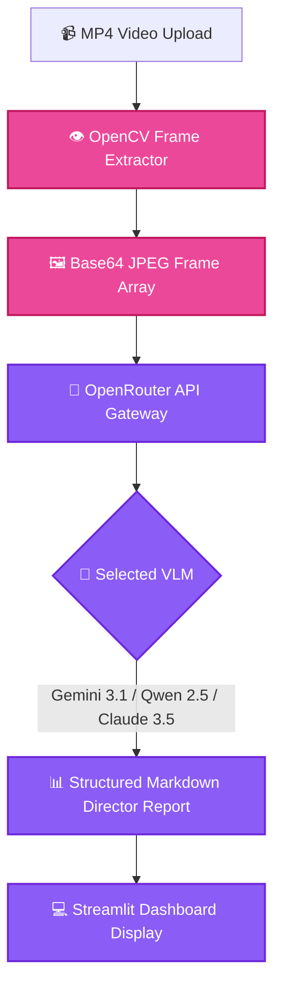

<p align="center">
  
</p>

<h1 align="center">🎬 AI Video Director</h1>

<p align="center">
  <strong>AI-Powered Cinematography & Directorial Intent Deconstruction via Multi-VLM & OpenCV.</strong>
</p>

<p align="center">
  <a href="#-overview">Overview</a> •
  <a href="#-features">Features</a> •
  <a href="#-code-architecture">Code Architecture</a> •
  <a href="#-system-flow">System Flow</a> •
  <a href="#-project-structure">Structure</a> •
  <a href="#-quick-start">Quick Start</a> •
  <a href="#-license">License</a>
</p>

<p align="center">
     
</p>

---

## 📌 Overview

AI Video Director is a specialized Streamlit application that 'reverse-compiles' video scenes from the perspective of a professional film director. Utilizing OpenCV for intelligent frame extraction and state-of-the-art Vision-Language Models (Gemini 3.1 Pro Preview, Qwen 2.5 VL 72B, Claude 3.5 Sonnet) via OpenRouter, it deconstructs camera dynamics, lighting setups, color grading palettes, and directorial storytelling arcs into structured production breakdown reports.

---

## ✨ Features (Key Outcomes & Capabilities)

| Icon | Feature | Outcome & Real Proof |
| :---: | :--- | :--- |
| 🎥 | **OpenCV Frame Sampling** | Uniform keyframe extraction (`cv2.VideoCapture`) with duration calculation and token-conscious base64 encoding |
| 🧠 | **Multi-VLM Integration** | Selectable models via OpenRouter (`google/gemini-3.1-pro-preview`, `qwen/qwen-2.5-vl-72b-instruct`, `anthropic/claude-3.5-sonnet`) |
| 🎬 | **Directorial Deconstruction** | Detailed critique covering camera dynamics, three-point lighting, color palette, and narrative subtext |
| 📊 | **Streamlit UI & Gallery** | Interactive video player, keyframe thumbnail grid, and instant Markdown report export |

---

## 🔬 Code Architecture & Implementation

### 🔬 Core Code Architecture (`app.py`)
- **Frame Sampler**: `cv2.VideoCapture` extracts uniform keyframes (configurable 3 to 10 frames) across video duration, encoding them to base64 JPEG strings for optimal token efficiency.
- **VLM Director Engine**: Sends multi-frame image payloads to OpenRouter's chat completions endpoint with an engineered directorial system prompt.
- **Cinematographic Breakdown Dimensions**:
  1. *Camera Work*: Shot size (Extreme Close-Up to Extreme Long Shot), camera angle (High, Low, Dutch), and dynamics (Pan, Tilt, Dolly, Tracking).
  2. *Lighting Design*: Key light direction, fill ratio, high-key/low-key contrast, and color temperature.
  3. *Color Palette*: Dominant hex colors, mood grading, and aesthetic cohesion.
  4. *Directorial Intent*: Subtext, emotional progression, and pacing critique.

---

## 📊 System Flow



---

## 📁 Project Structure

```bash
ai-video-director/
├── 📁 assets/                 # High-resolution SVG banners & media
│   └── 🎨 hero.svg
├── 📄 app.py                  # Streamlit application & VLM pipeline
├── 📄 requirements.txt        # streamlit, opencv-python, requests, etc.
└── 📄 README.md               # Complete documentation
```

---

## 🚀 Quick Start

```bash
# 1. Clone repository
git clone https://github.com/LoNebula/ai-video-director.git
cd ai-video-director

# 2. Install dependencies
pip install -r requirements.txt

# 3. Set OpenRouter API key in environment or Streamlit sidebar
export OPENROUTER_API_KEY="your-api-key"

# 4. Launch Streamlit app
streamlit run app.py
```

---

<p align="center">
  Released under the <a href="LICENSE">MIT License</a>. Crafted with precision by <a href="https://github.com/LoNebula">LoNebula</a>
</p>
