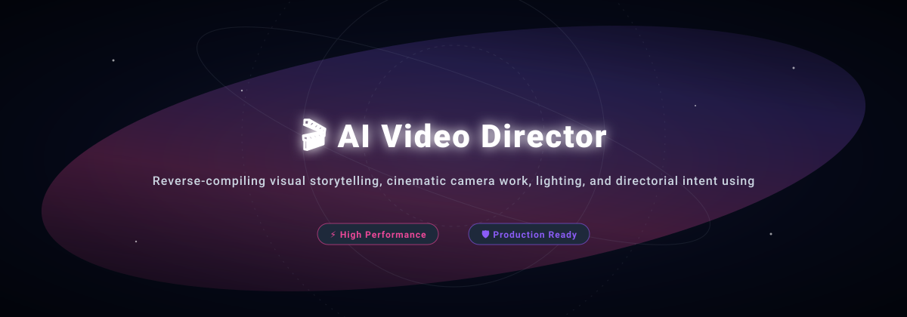
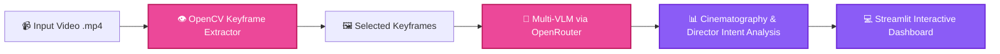

<p align="center">
  
</p>

<h1 align="center">🎬 AI Video Director</h1>

<p align="center">
  <strong>Reverse-compiling visual storytelling, cinematic camera work, lighting, and directorial intent using Vision-Language Models (VLM).</strong>
</p>

<p align="center">
  <a href="#-features">Features</a> •
  <a href="#-architecture">Architecture</a> •
  <a href="#-quick-start">Quick Start</a> •
  <a href="#-project-structure">Structure</a> •
  <a href="#-license">License</a>
</p>

<p align="center">
     
</p>

---

## ✨ Features (Key Outcomes & Capabilities)

| Icon | Feature | Outcome & Real Proof |
| :---: | :--- | :--- |
| 🎥 | **Smart Keyframe Extraction** | Extracts optimal keyframes using OpenCV scene variance, preserving narrative context while minimizing token cost |
| 🧠 | **State-of-the-Art Multi-VLM** | Direct integration with Gemini 3.1 Pro, Qwen 2.5 VL, and Claude 3.5 Sonnet via OpenRouter |
| 📐 | **Cinematography Deconstruction** | Analyzes shot scale, angle, camera dynamics (pan, tilt, dolly), key/fill lighting, color grading, and emotional arc |
| 📊 | **Structured Director Report** | Generates production-ready breakdown tables and directorial critique instantly in Markdown |

---

## 📊 Architecture & Flow



---

## 📁 Project Structure

```bash
ai-video-director/
├── 📁 assets/                 # High-resolution SVG banners & media
├── 📄 app.py                  # Streamlit application entry point
├── 📄 requirements.txt        # Python dependencies
└── 📄 README.md               # Project documentation
```

---

## 🚀 Quick Start

### Prerequisites
- Check language runtimes (Python / Node.js) and system dependencies.

```bash
# 1. Clone & enter repository
git clone https://github.com/LoNebula/ai-video-director.git
cd ai-video-director

# 2. Install dependencies
pip install -r requirements.txt

# 3. Launch application
streamlit run app.py
```

---

## 💡 Usage Notes & Tips

> [!TIP]
> Ensure all required environment variables and dependencies are properly configured before execution.

---

<p align="center">
  Released under the <a href="LICENSE">MIT License</a>. Made with ❤️ by <a href="https://github.com/LoNebula">LoNebula</a>
</p>
